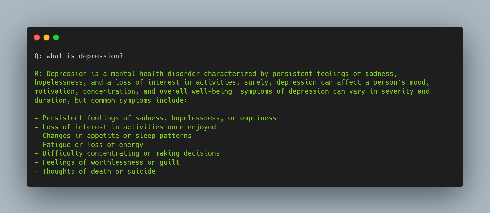

# Mental Health Companion

An AI-powered mental health support system that combines a fine-tuned LLM for mental health Q&A with a cyberbullying detection module. Built during the IIC Quest Hackathon.

## Features

- **Mental Health Q&A**: Fine-tuned Llama-2-7b model trained on mental health conversations
- **Cyberbullying Detection**: ML-based text classifier to identify harmful content
- **Backend API**: RESTful API for posts, comments, categories, and video resources

## Sample Response



*The model providing information about depression with detailed symptoms and guidance.*

---

## Local Deployment

### Prerequisites

- Python 3.10+
- Node.js 18+ (for backend)
- CUDA-compatible GPU (recommended for model training/inference)
- Hugging Face account with access to Llama-2-7b-chat-hf

### 1. Clone the Repository

```bash
git clone https://github.com/YuneshShrestha/momo.coders_iicquest.git
cd momo.coders_iicquest
```

### 2. Set Up Environment Variables

Create a `.env` file in the root directory:

```env
HUGGING_FACE_TOKEN=your_huggingface_token_here
```

For the backend, create `.env` in the `backend/` directory:

```env
DATABASE_URL="your_database_connection_string"
PORT=3000
```

---

## Running the Cyberbullying Detection App

### Step 1: Install Python Dependencies

```bash
pip install -r requirements.txt
```

### Step 2: Download NLTK Data (automatic on first run)

The app automatically downloads required NLTK data (`punkt`, `stopwords`).

### Step 3: Run the Streamlit App

```bash
streamlit run app.py
```

The app will open at `http://localhost:8501`

### Usage

1. Enter text in the input area
2. Click "Analyze"
3. View the prediction (Cyberbullying Detected / No Cyberbullying Detected) with confidence score

**Model Details:**
- Algorithm: Multinomial Naive Bayes with TF-IDF Vectorization
- Dataset: 448,000+ labeled comments
- Accuracy: ~90%

---

## Training the Mental Health LLM

The `final.ipynb` notebook fine-tunes Llama-2-7b on mental health Q&A data using LoRA (Low-Rank Adaptation).

### Step 1: Install Training Dependencies

```bash
pip install transformers datasets peft trl accelerate bitsandbytes
```

### Step 2: Prepare the Dataset

Ensure `dataset.json` is in the project root. Format:

```json
[
  ["What is depression?", "Depression is a mental health disorder..."],
  ["How to cope with anxiety?", "There are several strategies..."]
]
```

### Step 3: Configure Hugging Face Token

```python
import os
os.environ['HF_TOKEN'] = 'your_token_here'
```

Or set it in your `.env` file.

### Step 4: Run the Training Notebook

Open `final.ipynb` in Jupyter or Google Colab and execute all cells.

**Training Configuration:**
- Base Model: `meta-llama/Llama-2-7b-chat-hf`
- Quantization: 4-bit (QLoRA)
- LoRA Config: r=64, alpha=32, dropout=0.05
- Batch Size: 1 with gradient accumulation (16 steps)
- Learning Rate: 2e-4

### Step 5: Using the Trained Model

```python
from transformers import pipeline

pipe = pipeline(
    task="text-generation",
    model=model,
    tokenizer=tokenizer,
    max_length=120
)

prompt = "What is depression?"
result = pipe(f"<s>[INST] {prompt} [/INST]")
print(result[0]['generated_text'])
```

---

## Running the Backend API

### Step 1: Navigate to Backend Directory

```bash
cd backend
```

### Step 2: Install Dependencies

```bash
npm install
```

### Step 3: Set Up Database

```bash
npx prisma generate
npx prisma db push
```

### Step 4: Start the Server

```bash
npm run dev
```

The API will run at `http://localhost:3000`

### API Endpoints

| Method | Endpoint | Description |
|--------|----------|-------------|
| GET | `/api/posts` | Get all posts |
| POST | `/api/posts` | Create a post |
| GET | `/api/categories` | Get all categories |
| GET | `/api/categories/:id/posts` | Get posts by category |
| GET | `/api/posts/:postId/comments` | Get comments on a post |
| POST | `/api/comments` | Create a comment |
| GET | `/api/videos` | Get video resources |
| POST | `/api/answer` | Get AI-generated answer |

---

## Project Structure

```
mental-health-companion/
├── app.py                 # Streamlit cyberbullying detector
├── final.ipynb            # LLM fine-tuning notebook
├── cyber_bullying.ipynb   # Cyberbullying model training
├── dataset.json           # Mental health Q&A dataset
├── model.pkl              # Trained cyberbullying classifier
├── vectorizer.pkl         # TF-IDF vectorizer
├── requirements.txt       # Python dependencies
├── sample.png             # Model response sample
└── backend/
    ├── server.js          # Express server
    ├── package.json       # Node dependencies
    ├── prisma/
    │   └── schema.prisma  # Database schema
    ├── controllers/       # Route handlers
    └── routes/            # API routes
```

---

## Requirements

### Python (requirements.txt)

```
streamlit>=1.28.0
scikit-learn>=1.3.0
nltk>=3.8.0
numpy>=1.24.0
python-dotenv
```

### Additional for LLM Training

```
transformers
datasets
peft
trl
accelerate
bitsandbytes
torch
```

### Backend (Node.js)

```
express
@prisma/client
prisma
dotenv
nodemon
```

---

## Hardware Requirements

| Component | Minimum | Recommended |
|-----------|---------|-------------|
| RAM | 8 GB | 16 GB |
| GPU VRAM | 8 GB (for inference) | 16 GB (for training) |
| Storage | 20 GB | 50 GB |

*Note: The cyberbullying detector runs on CPU. GPU is only required for the LLM component.*

---

## License

ISC

---

## Acknowledgments

- Built at IIC Quest Hackathon
- Uses Meta's Llama-2-7b-chat model
- Hugging Face Transformers library
